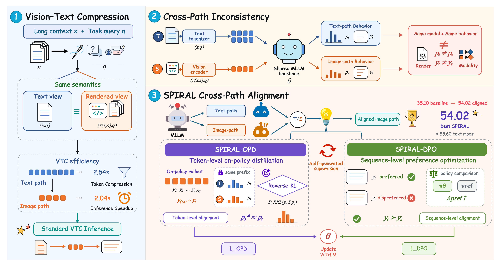

<div align="center">
  <h1>Same Semantics, Different Paths: Self-Improving Alignment for Vision-Text Compression</h1>
</div>

<div align="center">

<a href="https://arxiv.org/abs/2608.02109"></a>&ensp;
<a href="https://github.com/Tianyu-Liang-seu/SPIRAL"></a>&ensp;
&ensp;
<a href="./LICENSE"></a>

**Tianyu Liang<sup>1</sup>, Xiangxi Zheng<sup>2</sup>, Yilin Wang<sup>3</sup>, Dongxing Mao<sup>4†</sup>**

<sup>1</sup>Southeast University &nbsp;&nbsp;
<sup>2</sup>Nanjing University &nbsp;&nbsp;
<sup>3</sup>Zhejiang University &nbsp;&nbsp;
<sup>4</sup>National University of Singapore

† Corresponding author

</div>

---

> **Code, model checkpoints, training data recipes, and evaluation scripts are coming soon.**

**SPIRAL** (Self-improving Path Integration and Realignment) is a self-supervised alignment framework for **Vision-Text Compression (VTC)**. VTC renders long textual contexts into dense page images and encodes them with a vision encoder, substantially reducing the number of input tokens. However, the native-text path and rendered-image path can produce very different model behavior even when they carry exactly the same semantics.

SPIRAL treats this **cross-path inconsistency** as the central bottleneck. It uses the model's own native-text behavior to supervise its rendered-image behavior at two complementary granularities:

- **SPIRAL-OPD:** token-level on-policy distillation for fine-grained faithfulness and retrieval.
- **SPIRAL-DPO:** sequence-level preference optimization for global reasoning and memory.

SPIRAL requires **no external teacher, additional annotation, or reward model**. Alignment is used only during training, so inference retains the original VTC efficiency.

<div align="center">

</div>

## 📢 News and Updates

- `2026.08.04` We release the **SPIRAL** project page. Code, model checkpoints, and data recipes are coming soon.
- `2026.08.03` Our paper is available on [arXiv](https://arxiv.org/abs/2608.02109).
- `2026.07.10` 🎉 Our paper is accepted as an **Oral** paper at **ACM Multimedia 2026 (MM '26)**.

## ✨ Highlights

- **Reframes VTC around alignment:** the main challenge is not only compressing more tokens, but aligning rendered-image representations with native-text semantics.
- **Self-improving supervision:** the shared MLLM backbone acts as its own teacher through the stronger native-text path.
- **Complementary alignment granularities:** OPD provides dense token-level supervision, while DPO supplies holistic sequence-level preferences.
- **Strong VTCBench performance:** Qwen3-VL-8B improves from **35.10** to **54.02**, approaching native-text performance (**55.60**).
- **Efficient inference:** the rendering setup achieves **2.54× token compression** and **2.04× forward-pass speedup**, with no extra inference-time modules.
- **Generalization:** gains transfer to unseen context lengths up to 32k, out-of-domain benchmarks, and InternVL3.5-8B.

## 🧠 Method

### Cross-Path Inconsistency

For the same context $x$ and query $q$, VTC provides two semantically equivalent input paths:

- **Text path:** native text is processed by the tokenizer.
- **Image path:** text is rendered into page images and processed by the vision encoder.

Although both paths share the same MLLM backbone, their output distributions can diverge substantially because the vision encoder is primarily pretrained on natural images and remains sensitive to glyphs, fonts, spacing, and layout.

SPIRAL explicitly aligns the image-path distribution $p_S$ toward the text-path distribution $p_T$.

### SPIRAL-OPD: Token-Level Alignment

SPIRAL-OPD samples trajectories from the rendered-image path and evaluates the native-text teacher distribution at the same decoding prefixes. The default objective uses reverse KL:

$$

\mathcal{L}_{\mathrm{OPD}}
=
\sum_{t \in \mathcal{Y}}
D_{\mathrm{RKL}}
\left(
p_S(\cdot \mid y_{<t}, r(x,s), q)
\parallel
p_T(\cdot \mid y_{<t}, x, q)
\right).
$$

This on-policy supervision directly targets states encountered during image-path inference and is particularly effective for precise information retrieval.

### SPIRAL-DPO: Sequence-Level Alignment

SPIRAL-DPO constructs self-generated preference pairs:

- $y^+$: response generated from the native-text input.
- $y^-$: response generated from the rendered-image input.

Both responses are scored under the rendered-image condition, and DPO shifts the image-input policy toward text-quality responses. This sequence-level signal is especially effective for reasoning and long-range memory and scales efficiently with larger preference datasets.

## 🤗 Models

| Model | Backbone | Alignment | Checkpoint |
|---|---|---|---|
| SPIRAL-OPD-Qwen3-VL-8B | Qwen3-VL-8B | Token-level OPD | **Coming soon** |
| SPIRAL-DPO-Qwen3-VL-8B | Qwen3-VL-8B | Sequence-level DPO | **Coming soon** |
| SPIRAL-OPD-InternVL3.5-8B | InternVL3.5-8B | Token-level OPD | **Coming soon** |
| SPIRAL-DPO-InternVL3.5-8B | InternVL3.5-8B | Sequence-level DPO | **Coming soon** |

## 📊 Main Results

### VTCBench

Results use the predefined rendering configuration. Higher is better.

| Model | Retrieval | Reasoning | Memory | Total |
|---|---:|---:|---:|---:|
| Qwen3-VL-8B (text mode) | 99.17 | 37.26 | 30.36 | 55.60 |
| Qwen3-VL-8B (VTC baseline) | 74.50 | 5.95 | 24.86 | 35.10 |
| **SPIRAL-DPO (Qwen3-VL-8B)** | 83.01 | **44.17** | **34.14** | 53.77 |
| **SPIRAL-OPD (Qwen3-VL-8B)** | **89.34** | 40.74 | 31.98 | **54.02** |
| InternVL3.5-8B (VTC baseline) | 13.83 | 3.15 | 23.40 | 13.46 |
| **SPIRAL-DPO (InternVL3.5-8B)** | **24.99** | 8.48 | 27.53 | 20.33 |
| **SPIRAL-OPD (InternVL3.5-8B)** | 23.79 | **13.52** | **30.52** | **22.61** |

### Out-of-Domain Generalization

| Method | LongBench | TriviaQA | 2WikiMultihopQA | GSM8K |
|---|---:|---:|---:|---:|
| Text mode | 51.78 | 92.16 | 56.17 | 94.80 |
| VTC baseline | 34.62 | 85.11 | 40.94 | 88.70 |
| SFT | 36.50 | 88.20 | 36.31 | 89.10 |
| SPIRAL-OPD | 37.07 | **88.88** | 47.14 | 89.60 |
| SPIRAL-DPO | **37.98** | 88.56 | **48.16** | **90.20** |

## ⚡ Compression and Inference Efficiency

The paper uses an HTML/CSS rendering pipeline based on Playwright/Chromium:

| Setting | Value |
|---|---|
| Page resolution | 896 × 896 pixels |
| Rasterization | 96 DPI, JPEG quality 85 |
| Font | Helvetica, 12 px |
| Line height | 1.2 |
| Average native-text tokens | 20,673 |
| Average visual-path tokens | 8,145 |
| Token compression | **2.54×** |
| Forward-pass speedup | **2.04×** |

Only the long context is rendered; the task query remains native text.

## 🗂️ Training Data

The dual-view training set contains **115k** examples. Each example pairs the same task instance in two forms: a rendered-image student view and a native-text teacher view.

| Task type | Number of samples | Construction |
|---|---:|---|
| Retrieval | 40k | PG19 haystacks + RULER needles, 1k–8k contexts |
| Reasoning | 21k | PG19 haystacks + NoLiMa needles, 1k–4k contexts |
| Memory | 54k | Synthetic LoCoMo-style conversations |
| **Total** | **115k** | Dual-view self-supervision |

Incorrectly answered teacher samples and overlapping needle vocabularies are filtered.

**Dataset and data-construction recipes: Coming soon.**

## 🚀 Installation

**Coming soon.**

## 🖼️ Text Rendering

**Rendering code and reproduction instructions: Coming soon.**

## 🏋️ Training

### SPIRAL-OPD

**Training code, configuration files, and launch scripts: Coming soon.**

The paper uses reverse KL by default and jointly fine-tunes the vision encoder and language model.

### SPIRAL-DPO

**Training code, configuration files, and launch scripts: Coming soon.**

The paper uses $\beta = 0.1$, with native-text responses as preferred samples and rendered-image responses as dispreferred samples.

## 🔍 Evaluation

**Evaluation scripts and reproduction instructions: Coming soon.**

The primary evaluation covers:

- **Retrieval:** RULER
- **Reasoning:** NoLiMa
- **Memory:** LoCoMo
- **Generalization:** LongBench, TriviaQA, 2WikiMultihopQA, and GSM8K
- **Context lengths:** 1k–32k tokens

## 📁 Release Plan

| Component | Status |
|---|---|
| Rendering pipeline | Coming soon |
| Dual-view data construction | Coming soon |
| SPIRAL-OPD training code | Coming soon |
| SPIRAL-DPO training code | Coming soon |
| VTCBench evaluation scripts | Coming soon |
| Generalization evaluation scripts | Coming soon |
| Qwen3-VL-8B checkpoints | Coming soon |
| InternVL3.5-8B checkpoints | Coming soon |
| Training data or data-generation recipes | Coming soon |

## 📖 Citation

Please cite our paper if you find SPIRAL useful:

```bibtex
@inproceedings{liang2026spiral,
  title     = {Same Semantics, Different Paths: Self-Improving Alignment for Vision-Text Compression},
  author    = {Liang, Tianyu and Zheng, Xiangxi and Wang, Yilin and Mao, Dongxing},
  booktitle = {Proceedings of the 34th ACM International Conference on Multimedia},
  year      = {2026},
  address   = {Rio de Janeiro, Brazil},
  publisher = {Association for Computing Machinery},
  doi       = {10.1145/3767308.3836583}
}
```

Paper: [arXiv:2608.02109](https://arxiv.org/abs/2608.02109)

## 📄 License

The code in this repository is released under the [Apache License 2.0](./LICENSE).

The paper is distributed under the **Creative Commons Attribution 4.0 International License (CC BY 4.0)**.

Third-party models, datasets, evaluation suites, and dependencies remain subject to their respective licenses.

## 🙏 Acknowledgements

This project builds on the Qwen3-VL and InternVL model families and evaluates with VTCBench, RULER, NoLiMa, LoCoMo, LongBench, TriviaQA, 2WikiMultihopQA, and GSM8K. Please also cite the corresponding original works when using their models, datasets, or evaluation code.
